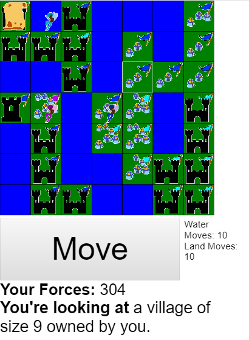
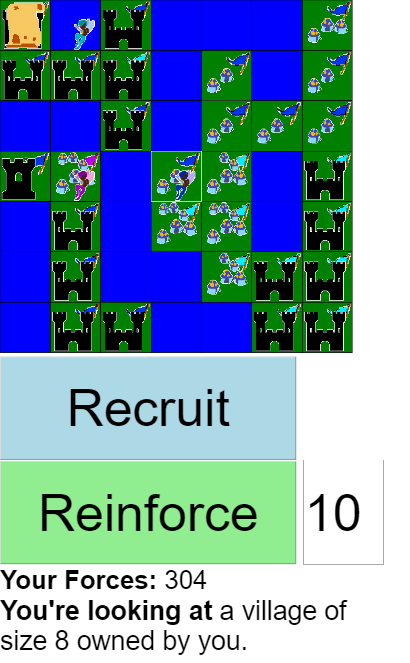

# CACOPH

[Play the game](https:/cacoph.herokuapp.com/)

Tile-based capture game inspired by David Deal's game "War of Nations".

## Usage

Optimized to be deployed from GitHub to Heroku. Enable the Heroku Postgres database addon.

## Disclaimer

I'm doing everything on master cuz I'm trash.

## Funding

[Find me on Ko-Fi](https://ko-fi.com/benpearson)

